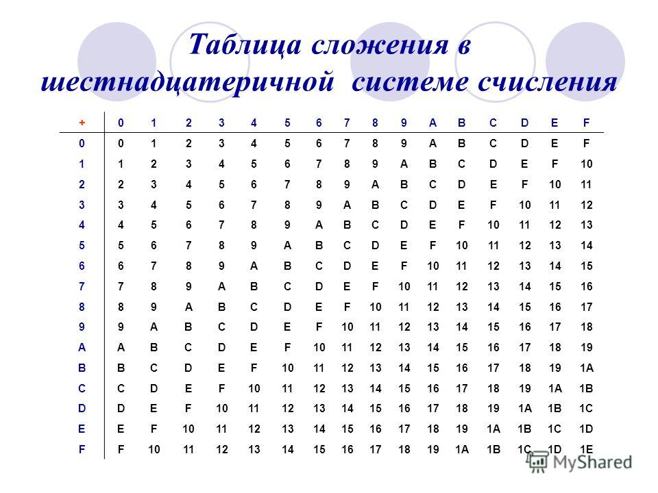
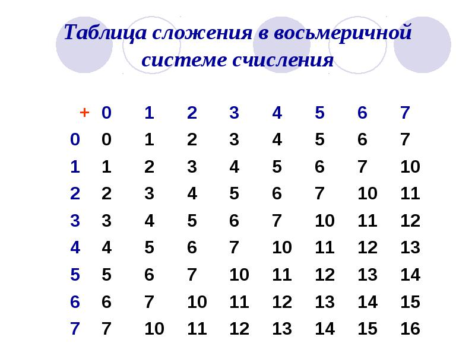
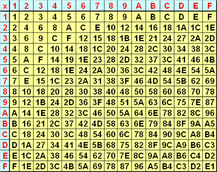
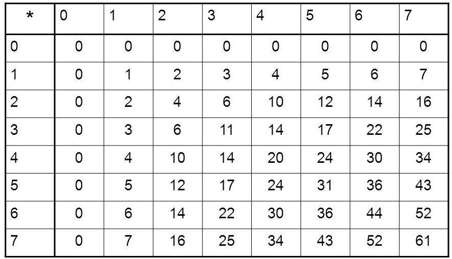

# Рабочая тетрадь по дискретной математике.

#### Таблица для перевода в %2 системах:
|(2)|(16)|(2)|(16)|
| :---:|:---:|:---:|:---:|
| 0000 | 0 | 1000 | 8 |
| 0001 | 1 | 1001 | 9 |
| 0010 | 2 | 1010 | A |
| 0011 | 3 | 1011 | B |
| 0100 | 4 | 1100 | C |
| 0101 | 5 | 0101 | D |
| 0110 | 6 | 1110 | E |
| 0111 | 7 | 1111 | F |

#### Таблица соответствия до 32х:

|0|1|2|3|4|5|6|7|
|---|---|---|---|---|---|---|---|
|00000|00001|00010|00011|00100|00101|00110|00111|
|0|1|2|3|4|5|6|7|


|8|9|A|B|C|D|E|F|
|---|---|---|---|---|---|---|---|
|01000|01001|01010|01011|01100|01101|01110|01111|
|8|9|10|11|12|13|14|15|

|G|H|I|J|K|L|M|N|
|---|---|---|---|---|---|---|---|
|10000|10001|10010|10011|10100|10101|10110|10111|
|16|17|18|19|20|21|22|23|

|O|P|Q|R|S|T|U|V|
|---|---|---|---|---|---|---|---|
|11000|11001|11010|11011|11100|11101|11110|11111|
|24|25|26|27|28|29|30|31|

#### Степени сновных чисел

|a^n|2|3|4|5|6|7|8|
|:---:|---|---|---|---|---|---|---|
|2|4|8|16|32|64|128|256|512|
|4|16|64|256|1024|4096|16384|65536|
|8|64|512|4096|32768|262144|*|*|*|
|16|256|4096|65536|*|*|*|*|*|
|32|1024|32768|*|*|*|*|*|*|

[Таблица степеней](http://calcs.su/%D0%BC%D0%B0%D1%82%D0%B5%D0%BC%D0%B0%D1%82%D0%B8%D0%BA%D0%B0/%D1%81%D1%82%D0%B5%D0%BF%D0%B5%D0%BD%D1%8C/%D1%82%D0%B0%D0%B1%D0%BB%D0%B8%D1%86%D0%B0-%D1%81%D1%82%D0%B5%D0%BF%D0%B5%D0%BD%D0%B5%D0%B9-%D0%BE%D1%82_1_%D0%B4%D0%BE_10.html)
 
## Перевод в 10 систему

### Без дробной части

```
1) 101101(2) -> ?(10)
2) 1 * 2^5 + 0 * 2^4 + 1 * 2^3 + 1 * 2^2 + 0 * 2^1 + 1 * 2^0 
3) 1 * 32 + 0 * 16 + 1 * 8 + 1 * 4 + 0 * 2 + 1 * 1
4) 32 + 0 + 8 + 4 + 0 + 1 = 45
```

```
1) 1073(8) -> ?(10)
2) 1 * 8^3 + 0 * 8^2 + 7 * 8^1 + 3 * 8^0 
3) 1 * 512 + 0 * 64 + 7 * 8 + 3 * 1
4) 512 + 0 + 56 + 3 = 572
```

```
1) 9AC(16) -> ?(10)
2) 9 * 16^2 + 10 * 16^1 + 12 * 16^0
3) 9 * 256 + 10 * 16 + 12 * 1
4) 2304 + 160 + 12 = 2476
```

### С дробной частью

```
1) 10111.11(2) -> ?(10)
2) 1*2^4 + 0*2^3 + 1*2^2 + 1*2^1 + 1*2^0 + 1·2^-1 + 1·2^-2
3) 1 * 16 + 0 * 8 + 1 * 4 + 1 * 2 + 1 * 1 + 1 * 1/2 + 1 * 1/4 -> = 23.75
```

```
1) 731.16(8) -> ?(10)
2) 7*8^2 + 3*8^1 + 1*8^0 + 1*8^-1 + 6*8^-2
3) 7 * 64 + 3 * 8 + 1 * 1 + 1 * 1/8 + 8*1/64 = 473.21875 (112/512)
```

```
1) 1FA.BC(16) -> ?(10)
2) 1*16^2 + F*16^1 + A*16^0 + B*16^-1 + C*16^-2
3) 1*256 + 15*16 + 10*1 + 11*(1/16) + 12*(1/256) = 506.734375 (752/1024)
```

## Перевод из 10 системы

### Без дробной части

```
1) 98(10) -> ?(2)
98/2 = 49, остаток: 0
49/2 = 24, остаток: 1
24/2 = 12, остаток: 0
12/2 = 6, остаток: 0
6/2 = 3, остаток: 0
3/2 = 1, остаток: 1
1/2 = 0, остаток: 1
Ответ: 1100010
```

```
1) 129(10) -> ?(8)
129/8 = 16, остаток: 1
16/8 = 2, остаток: 0
2/8 = 0, остаток: 2
Ответ: 201
```

```
1) 2748(10) -> ?(16)
2748/16 = 171, остаток: 12, 12 = C
171/16 = 10, остаток: 11, 11 = B
10/16 = 0, остаток: 10, 10 = A
Ответ: ABC
```

### С дробной частью
```
19.625(10)->?(2)
Переводим целую часть 19.625 в 2-ую систему делением на 2:
19/2 = 9, остаток: 1
9/2 = 4, остаток: 1
4/2 = 2, остаток: 0
2/2 = 1, остаток: 0
1/2 = 0, остаток: 1

19 = 10011
Переводим дробную часть 19.625 в 2-ую систему:
0.625·2 = 1.25
0.25·2 = 0.5
0.5·2 = 1.0

0.625 = 0.101
```

```
10.40625(10) = ?(8)
Переводим целую часть 10.4062510 в 8-ую делением на 8:
10/8 = 1, остаток: 2
1/8 = 0, остаток: 1

10 = 12
Переводим дробную часть 10.4062510 в 8-ую систему:
0.40625·8 = 3.25
0.25·8 = 2.0

0.40625 = 0.32
```

```
15.40625(10) -> ?(16)
Переводим целую часть 15.4062510 в 16-ую делением на 16:
15/16 = 0, остаток: 15, 15 = F

15 = F
Переводим дробную часть 15.4062510 в 16-ую систему:
0.40625·16 = 6.5
0.5·16 = 8.0

0.40625 = 0.68
```

## Перевод чисел по таблице

#### Таблица для перевода в %2 системах:
|(2)|(16)|(2)|(16)|
| :---:|:---:|:---:|:---:|
| 0000 | 0 | 1000 | 8 |
| 0001 | 1 | 1001 | 9 |
| 0010 | 2 | 1010 | A |
| 0011 | 3 | 1011 | B |
| 0100 | 4 | 1100 | C |
| 0101 | 5 | 1101 | D |
| 0110 | 6 | 1110 | E |
| 0111 | 7 | 1111 | F |

#### С понижением степени
```
FC29(16) -> ?(2)
-------------------
F    C    2    9
1111 1100 0010 1001

7620(8) -> ?(2)
---------------
7   6   2   0
111 110 010 000
```

#### С повышением степени степени
```
101110101001110(2) -> ?(16)
---------------------------
* Выделяем числа с права на лево <-
1) 0101 | 1101 | 0100 | 1110
2) 5    | D    | 4    | E 
```
## Сложение и вычитание в системах счисления

Таблица сложения в 16-ой системе



Таблица сложения в 8-ой системе



## Деление и умножение в системах счисления

Таблица умножения в 16-ой системе



Таблица умножения в 8-ой системе



## Факториальная и Фибоначиевая системы

### Факториальная

В факториальной системе счисления базисом выступают числа фактобираьного ряда.

|1!|2!|3!|4!|5!|6!|7!|8!|9!|
|---|---|---|---|---|---|---|---|---|
|1|2|6|24|120|720|5040|40320|362880|

### Фибоначиевая
